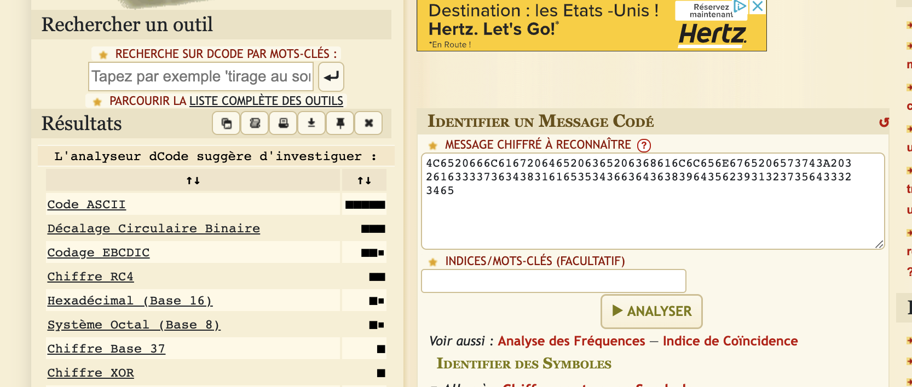
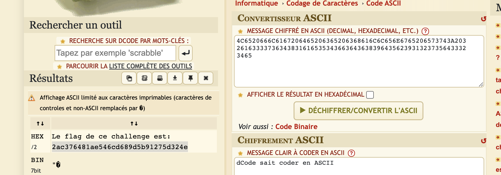
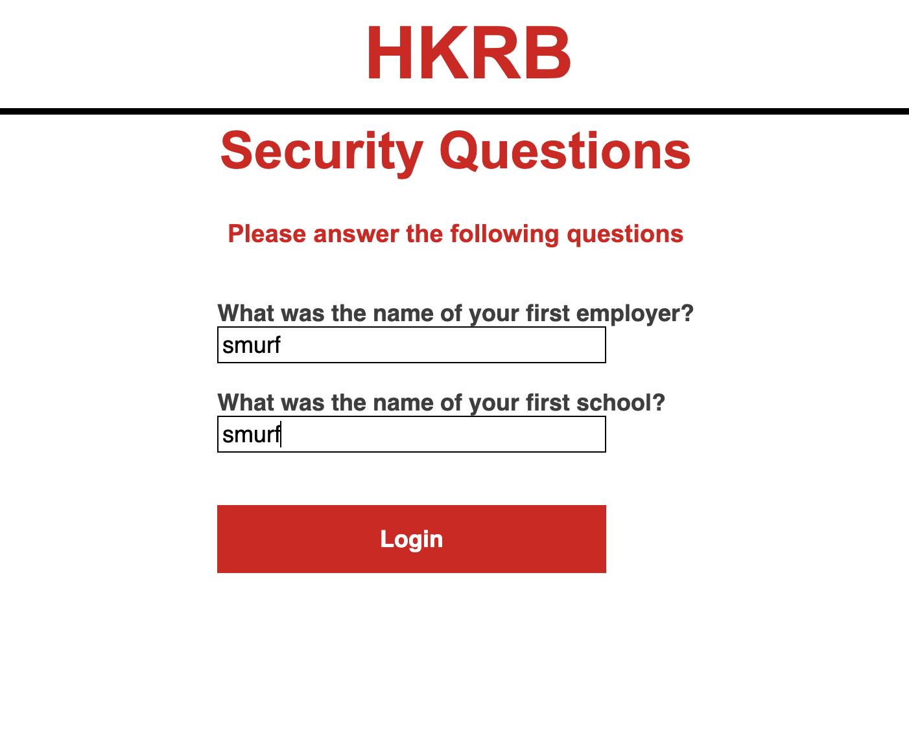
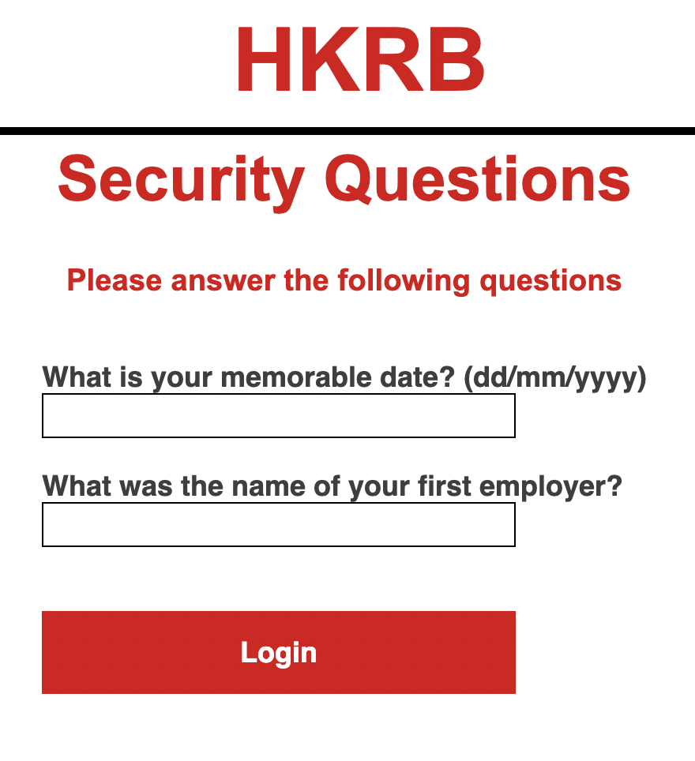
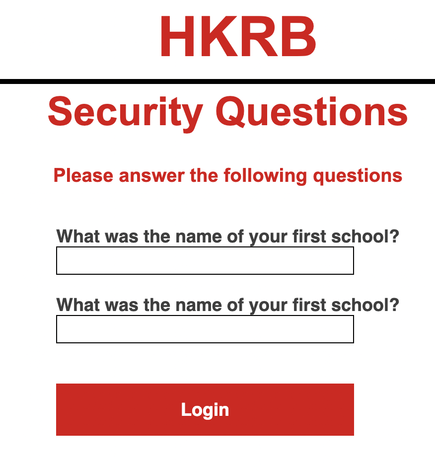
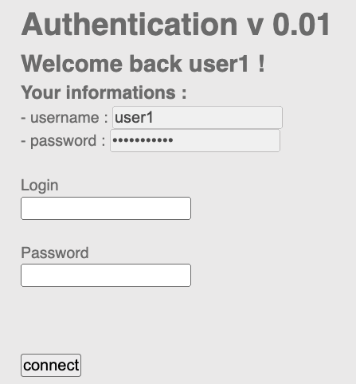

# Security Challenge

## **[Web client] HTML - Code Source**

**Flag N° 1** - Difficulté : 1

Il suffit de faire un clique droit, et afficher le code source, le code est inscrit :

> code: `nZ^&@q5&sjJHev0`

## **[Web client] HTML - boutons désactivés**

**Flag N° 2** - Difficulté : 1

Pour avoir le flag, il faut simplement enlever le mot-clé `disabled` dans les inputs. Et dans l’input de type text, on met n’importe quoi et on soumet !

> code: `HTMLCantStopYou`

## **[Cryptanalyse] Decode**

**Flag N° 3** - Difficulté : 1

Nous allons nous rendre sur le site [dcode.fr](http://dcode.fr) pour décoder la chaîne de caractère. Mais je ne sais pas en quoi il faut le décoder (en théorie), je vais me rendre ici : [https://www.dcode.fr/identification-chiffrement](https://www.dcode.fr/identification-chiffrement) et je colle la chaîne de caractère et à droite, j’ai une liste qui me dit le décode le plus probable :



Je vais donc choisir `Code ASCII` qui est le plus probable et refaire la manipulation.



> code: `2ac376481ae546cd689d5b91275d324e`

## **[Web client] Javascript - Authentification**

**Flag N° 4** - Difficulté : 1

Nous devons inspecter le code et voir qu’il y a un script qui se lance à la soumission du formulaire, je vais donc chercher le fichier JS, celui-ci est dispo’ à cette adresse :

[http://challenge01.root-me.org/web-client/ch9/login.js](http://challenge01.root-me.org/web-client/ch9/login.js)

Et à l’intérieur nous avons les infos qu’on souhaite :

> code: `sh.org`

## **[Web server] Very very low password**

**Flag N° 5** - Difficulté : 1

Pour celui-là, je n’ai pas cherché à comprendre : admin / admin

> code: `admin`

## **[Web client] Rand Game**

**Flag N° 6** - Difficulté : 1

Si on tente d’analyser la page, la seule chose qu’on peut voir, c’est qu’il y a 1 bouton qui fait tout.

Alors si on affiche le code source, on voit qu’il y a une fonction à la soumission du formulaire. Nous allons donc changer ça, car j’ai la possibilité de le faire 😎 :

```jsx
document.getElementsByName("score")[0].value = 1000000000;
```

Je soumet et hop !

> code: `H7tp_h4s_N0_s3Cr37S_F0r_y0U`

## **[Web client] Hack la banque**

**Flag N° 7** - Difficulté : 2

Il faut se connecter avec le compte dont l’id est `*59247213*` et ensuite je regarde l’url à chaque fois. Mais pour ce challenge, il y a 2 façons de le hack.

### Façon 1

Quand on se connecte avec l’id `*59247213*` ensuite tous les champs, c’est `smurf`

Quand j’arrive sur la page des questions, je remarque que l’URL est la suivante :

`/login2?q1=3&q2=1`

ici, q1 = 3 veut dire que pour la 1re question, je demande la question : **What was the name of your first employer?**

Et la question 2 = 1 veut dire que je demande la question : **What was the name of your first school?**

Or, dans l’énoncé, on me dit que j’ai la réponse à 1 question qui est **What was the name of your first school?** donc j’ai toutes les infos, je vais quand même me connecter pour voir la route



Une fois logué, j’ai la route `/account` avec des info dessus.

Si je reviens vers l’id `16554987` je vais pouvoir changer l’url pour qu’il correspond à mes infos

```jsx
/login2?q1=2&q2=3
```



```jsx
/login2?q1=1&q2=1
```



Je mets l’info qu’on me donne : `Bristol Grammar School`

Et hop !

> code: `13780`

### Façon 2

Quand je me logue avec l’id `16554987` et mdp : `mustang73` j’arrive sur la page des questions,

Or, j’ai déjà un cookie de session 😃
Donc, je me rends sur la route /account et hop, ça fonctionne !

> code: `13780`

## **[Web client] Admin usurpation**

**Flag N° 8** - Difficulté : 2

Nous avons juste à faire à changer dans l’url l’admin de `false` à `true` 😅

> code: `magical`

## **[Web client] Javascript - Source**

**Flag N° 9** - Difficulté : 2

Il faut simplement afficher le code source, le code est dedans.

> code: `123456azerty`

## **[XSS] Hack la recherche**

**Flag N° 10** - Difficulté : 2

Il suffit de faire un script pour passer à l’étape d’après.

```jsx
<script>alert("hacked!")</script>
```

> code: `Persistence is key`

## **[Web client] Usurpation de navigateur**

**Flag N° 11** - Difficulté : 3

Il y a plusieurs façons de faire, moi, je l’ai fait avec curl :

```jsx
curl -A "W3Challs_browser" http://change-browser.hax.w3challs.com/
```

Mais il est possible de changer le user agent depuis chrome, je vous laisse faire les recherches 😃

> code: `W3C{now_that_we_have_the_right_browser_lets_get_the_party_started}`

## **[Web client] Javascript - Obfuscation**

**Flag N° 12** - Difficulté : 3

Dès qu’on ouvre la page, on nous demande un MDP, on passe, et ensuite, on ouvre l’inspecteur et on affiche le code source.

On voit un script dont le pass est `obfusqué` !

Pour avoir le mdp, j’ai juste à afficher dans un `console.log()` le mdp

```jsx
pass = "%63%70%61%73%62%69%65%6e%64%75%72%70%61%73%73%77%6f%72%64";
console.log(unescape(pass));
// output
// cpasbiendurpassword
```

> code: `cpasbiendurpassword`

## **[Web Server] HTTP - Directory indexing**

**Flag N° 13** - Difficulté : 3

On affiche le code source, et on voit qu’il y a une route `/admin/pass.html`.

Nous n’allons pas nous rendre dans `/admin/pass.html` mais juste on s’arrête à `/admin`.

Et on voit une liste de dossier et celui qui nous intéresse est `/backup` et ensuite `admin.txt`

> code: `LINUX`

## **[Web server] Injection**

**Flag N° 14** - Difficulté : 4

En login, j’ai mis `admin` peu importe ce que vous mettez, ça n’a pas d’importance.

En MDP, je fais l’injection de base : `' or '1' = '1`



Ensuite, j’affiche le code source de la page pour voir la `value` dans l’input du password.

> code: `TYsgv75zgtq`

## **[Web server] HTTP - Open redirect**

**Flag N° 15** - Difficulté : 4

J’ai fait une requête curl pour avoir le flag:

L’option `-G` est pour définir que c’est une requête en GET.

L’option `-d` permet de donner une `data`

L’option `-o` pour output. Toute ma page sera enregistré dans le fichier `wcs-challenge.txt`

```jsx
curl -G http://challenge01.root-me.org/web-serveur/ch52/ -d "url=https://google.fr&h=0edf27c83d4aa4699c0625d27be0e371" -o wcs-challenge.txt
cat wcs-challenge.txt
```

> code: `e6f8a530811d5a479812d7b82fc1a5c5`

Sinon, on peut faire autrement.

### Façon 2

Sinon, on n’utilise pas curl, mais une autre astuce :

```jsx
href =
  "?url=https://facebook.com:returnUrl:https://google.com&h=890de9e50031be5ea99c140aa16825af";
```

Ici, le hash est fait par `MD5`, on hash `https://facebook.com:returnUrl:https://google.com`

Et ça nous donne `890de9e50031be5ea99c140aa16825af` du coup, nous avons maintenant le hash devant nos yeux !

> code: `e6f8a530811d5a479812d7b82fc1a5c5`

## **[XSS] Tchat scripting**

**Flag N° 16** - Difficulté : 4

Nous allons faire une injection via une image, et oui, les images sont rarement sanitize, donc on en profite !

```jsx

```

> code: `That sinking feeling...`

# Et voilà !
